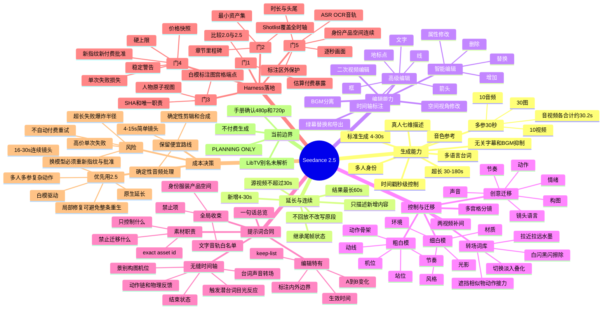

# Seedance 2.5 → Harness 思维导图

```mermaid
mindmap
  root((Seedance 2.5))
    生成能力
      标准生成 4-30s
      多参30秒
        30图
        10视频
        10音频
        音视频各合计约30.2s
      超长 30-180s
      真人七维描述
      多人身份
      多语言台词
      音色参考
      时间戳秒级控制
      无关字幕和BGM抑制
    延长与连续
      源视频不超过30s
      新增4-30s
      结果最长60s
      继承尾帧状态
      只描述新增内容
      不回放不改写原段
    编辑能力
      智能编辑
        增加
        删除
        替换
        属性修改
      高级编辑
        框
        线
        箭头
        文字
        地标点
        时间轴标注
      二次视频编辑
      BGM分离
      绿幕替换和导出
      空间视角修改
    控制与迁移
      创意迁移
        动作
        节奏
        镜头语言
        情绪
        构图
        声音
      粗白模
        动作骨架
        动线
        机位
        站位
        节奏
      细白模
        材质
        光影
        环境
        风格
      两视频补间
      多宫格分镜
      转场词库
        切换淡入叠化
        白闪黑闪擦除
        遮挡相似物动作接力
        拉近拉远水墨
    提示词合同
      素材职责
        exact asset id
        只控制什么
        禁止迁移什么
      一句话总览
      无缝时间轴
        景别构图机位
        动作链和物理反馈
        触发潜台词目光反应
        台词声音转场
        结束状态
      全局收束
        身份服装产品空间
        文字音轨白名单
        禁止项
      编辑特有
        A到B变化
        生效时间
        keep-list
        标注内外边界
    Harness落地
      门1
        比较2.0与2.5
        估算付费暴露
      门2
        Shotlist覆盖全时轴
        章节里程碑
        最小资产集
      门3
        人物原子视图
        白模标注图宫格端点
        SHA和唯一职责
      门4
        硬上限
        稳定警告
        价格快照
        单次失败损失
        新指纹新付费批准
      门5
        逐秒画面
        ASR OCR音轨
        时长与头尾
        标注区外保护
        身份产品空间连续
    成本决策
      优先用2.5
        16-30s连续镜头
        多人多参复杂动作
        原生延长
        白模驱动
        局部修复可避免整条重生
      保留便宜路线
        4-15s简单镜头
        确定性音频处理
        确定性剪辑和合成
      风险
        高价单次失败
        超长失败爆炸半径
        不自动付费重试
        换模型必须重新指纹与批准
    当前边界
      手册确认480p和720p
      LibTV别名未解析
      PLANNING ONLY
      不付费生成
```

## 一句话使用方法

以后只要说“用 Seedance 2.5 的某项功能”，Harness 先命中对应 capability，加载该项提示词合同和 Gate 5 验收项，然后在门 4 展示本次精确价格、失败暴露和付费边界。
